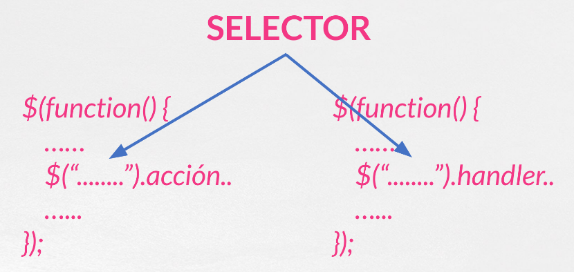

## Parte III.1. Selectores CSS I

Para poder dotar de vida e interactividad a nuestra página web lo primero que debemos hacer siempre es seleccionar los elementos con los que vamos a trabajar.

Para poder realizar esta selección con **jQuery** podremos usar tanto los selectores de _CSS3_ como una serie de selectores propios.

En este capítulo y en el siguiente vamos a recordar los selectores _CSS3_ más comunes.

Tanto para estos selectores de _CSS3_ como para los selectores propios de **jQuery** la forma de trabajar suele ser siempre la misma, una de estas dos iteraciones:

- **Selección - Acción** (ocultar, cambiar propiedades, aplicar efectos etc..).
- **Selección - Añadir Handler de Evento**.

Si ponemos esto con síntaxis de _jQuery_ nos quedará como en la siguiente imagen:



Es entre las **""** donde nosotros incluiremos los selectores.

### Selectores CSS más comunes I

Una vez hemos fijado la forma de trabajar vamos a repasar los selectores más frecuentes. Empezaremos en este capítulo y continuaremos en el siguiente.

- **\***: El selector universal.
- **etiqueta** : Para seleccionar una etiqueta en concreto.
- **#id** : Elementos con un id determinado.
- **.clase** : Elementos con una clase determinada.
- **elemento1 elemento2** : Elementos que se encuentran anidados dentro de otro elemento.
- **elemento1 > element2** : Elementos que son hijos directos de un elemento dado.
- **elemento1 + elemento2** : Hermanos contiguos. El elemento2 sigue al elemento 1.
- **elemento1 ~ elemento2** : Hermanos aunque no sean adyacentes.
- **Selectores de atributos** con todas las combinaciones posibles [attr][attr="value"] (o usando | ~ ^ etc..)

Si queremos conocer más selectores os recomiento este enlace:

[https://developer.mozilla.org/es/docs/Web/CSS/Selectores_CSS](https://developer.mozilla.org/es/docs/Web/CSS/Selectores_CSS)

### Selectores que devuelven más de un elemento

Es imporante destacar que cuando seleccionamos elementos el selector nos puede devolver uno o varios elementos.

En algunos casos podemos querer escoger un único elemento de entre todos los seleccionados. Eso se hace con la función **.eq(index)** aplicada después del selector. Con _index_ especificaremos la posición del elemento (empezando en la posición 0) que queremos seleccionar entre todos los devueltos por el selector.

Un ejemplo práctico podría ser el siguiente:

```js
$(function() {
  //Ocultamos el tercer elemento de lista encontrado
  $("li")
    .eq(2)
    .hide();
});
```

Esa contatenación de funciones después de la selección se llama **CHAINING** y veremos que lo usaremos mucho en jQuery (y de manera general en javascript).

En capitulos posteriores veremos como filtrar y encontrar elementos usando otras funciones.

Repositorio del Curso de jQuery desarrollado por @pekechis para @OpenWebinars.
