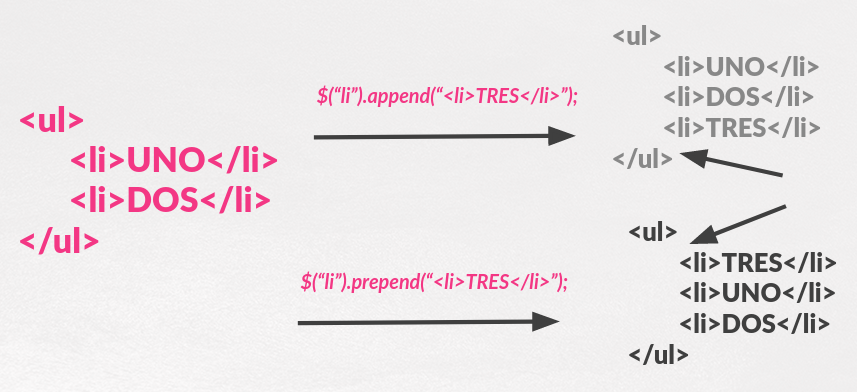
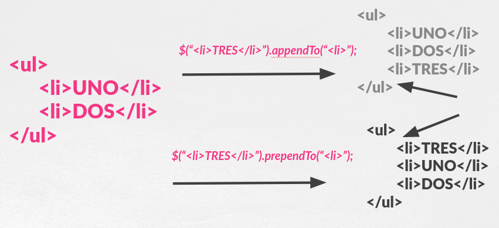
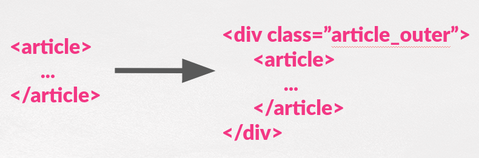
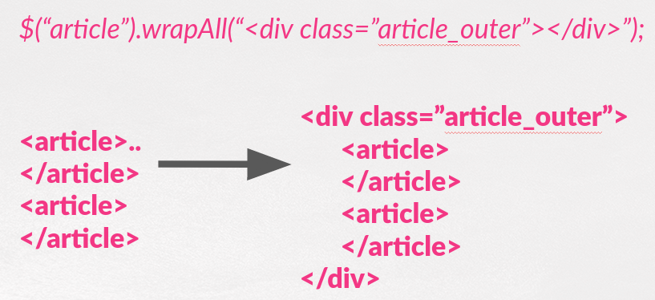
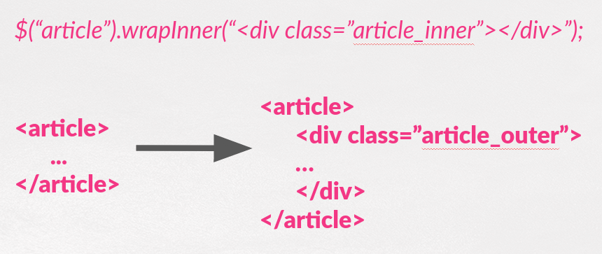

## Parte IV.4. Valores y Contenido 

En los capítulos anteriores hemos _respetado_ el árbol HTML y no hemos tocado el DOM. Nos hemos limitado a modificar estilos y atributos.

Pero...en ocasiones querremos modificar esa estructura añadiendo, borrando o modificando elementos del árbol o su contenido.

Afortunadamente **jQuery** nos proporciona muchas funciones para eso.

Estas funciones las vamos a agrupar en:

* .empty(), .html() y .text()
* .append(), .prepend(), .appendTo() , .prependTo()
* .wrap(), .unwrap() , .wrapAll() , .wrapInner()
* .val(). Luego hablaré de los motivos por los que he metido esta función aquí.


### .empty(), .html() y .text()

La función **.empty()** borra todos los nodos hijos(y su contenido) de los elementos seleccionados.

Un ejemplo sería el siguiente:

```js

    $("ul").empty();

```

De tal manera que si tenemos esta estructura HTML inicial:

```html
    <ul>
        <li>UNO</li>
        <li>DOS</li>
        <li>TRES</li>
    </ul>
```

La estructura resultante sería:

```html
    <ul></ul>
```

La función **.html()** puede ser usada para obtener el **contenido** del **primer elemento** de los seleccionados. Esto quiere decir que obtendremos todo lo que va entre la apertura y el cierre de ese elemento.

Por ejemplo:

```js
    //content contienen todo lo que va dentro de esa <li>. Posible etiquetas incluidas
    var content = $("li").html();
```

Además de para obtener el contenido, con esta función podemos modificar el contenido de **TODOS** los elementos seleccionados.

Vamos a ilustrar las diferentes posibilidades con ejemplos:

```js

    //Hacer que el contenido de todas las listas sea un único elemento
    //Sustituye el contenido que tuviera
    $("ul").html("<li>UNO</li>);

    //Lo mismo pero usando una función que pone a nuestra disposición la posición dentro de los elementos seleccionados y el texto anterior.
    $("ul").html(function(index,oldText) {
        return "<li>"+index+"</li>";
    });

```

El uso de la función **.text()** es totalmente análogo a .html() pero con la diferencia de que trata todo como **TEXTO** y **obvia las etiquetas** quedándose únicamente con el contenido textual de los elementos.

### .append() / .prepend() / .appendTo() / .prependTo()


las funciones **.append()** y **.prepend()** son análogas en su funcionamiento. Ambas sirven para añadir nuevos elementos HTML a nuestro DOM.

La diferencia principal es que:

* **.append("contenido")** añade ese contenido justo al principio de los elementos seleccionados.
* **.prepend("contenido")** añade ese contenido justo al final de los elementos seleccionados.

Y cuando nos referimos al principio o al final nos referimos a justo después de la etiqueta de inicio de los elementos seleccionados o a justo antes de la etiqueta de cierre de los elementos seleccionados.

Se entiende mejor con esta imágen.




Las funciones **.appendTo()** y **.prependTo()** funcionan de manera muy similar a las dos anteriores pero tenemos un par de cambios:

* Donde antes estaba el contenido está el selector de los elementos en los cuales vamos añadir contenido.
* Donde antes estaba el selector tengo el contenido.

Se entiende mejor con una imagen análoga a la anterior pero usando estas funciones:




### .wrap() / .unwrap() / .wrapAll() / .wrapInner()

La función **.wrap()** añade cierta estructura HTML alrededor de todos y cada uno de los elementos seleccionados.

Tiene varias posibilidades:

```js

    //Envuelve todos los article con una estructura
    $("article").wrap("<div class="article_outer"></div>");

    //O usando una función que pone a nuestra disposición la posición dentro de los elementos seleccionados
    $("article").wrap(funcion(index) {
        return "<div class='article-"+index+"'></div>";
    });

```

Podemos entenderlo mejor con esta imagen:



La función **.unwrap()** hace justo lo contrario que .wrap().Elimina el padre y saca el hijo a la altura del árbol que estaba el padre.

Por lo tanto:

```js
    //Deshacer el cambio anterior hecho con WRAP
    $("article").unwrap(); 
    //Si queremos comprobar que el padre cumple condiciones
    $("article").unwrap(".article_outer");

```

En relación a las otras dos funciones:

* **wrapAll()** es análogo a .wrap() pero sólo añade un elemento envolvente que cubre a todos los seleccionados. Debemos tener cuidado si hay elementos _intrusos_ o diferentes entre ellos.
* **wrapInner()**  es análogo a .wrap() pero el elemento envolvente se añade no como padre sino al contenido de los seleccionados.

Vamos a entenderlo mejor con las siguientes imágenes:







### .val()

He decidido meter aquí la función **.val()** aquí porque aunque no modifica el DOM si que modifica en cierta manera el contenido de la página al cambiar el valor de los elementos, normalmente de los elementos de los formularios.

Usando **.val()** podremos obtener y fijar el valor de los distintos campos de los formularios.

Para ilustrar ambas posibilidades vamos a ver la síntaxis general y ejemplos:

```js
    //Para obtener el valor de un campo de formulario. El PRIMERO de los seleccionados
    var valor = $("some_selector").val();

    //Para fijar el valor para TODOS los campos seleccionados
    $("some_selector").val("some_value");

    //O usando una función. La posición, el valor actual y $(this) disponibles
    //El valor de retorno será el valor del elemento seleccionado
    $("some_selector").val(funcion(index,valor) {
    ….
    });
```

Un ejemplo para cada uno de estos casos:

```js
    //Obtengo el valor del primer input de tipo texto
    var valor = $("input[type=text]).val();

    //Todos los input de tipo text van a mostrar "Insert Value"
    $("input[type=text).val("Insert Value");

    
    //Voy a añadir al valor que tenían -> y la posición de entre los selecciondos.
    $("input[type=text).val(funcion(index,valor) {
        $(this).val(valor+"->"+index);
    });


```
Repositorio del Curso de jQuery desarrollado por @pekechis para @OpenWebinars
