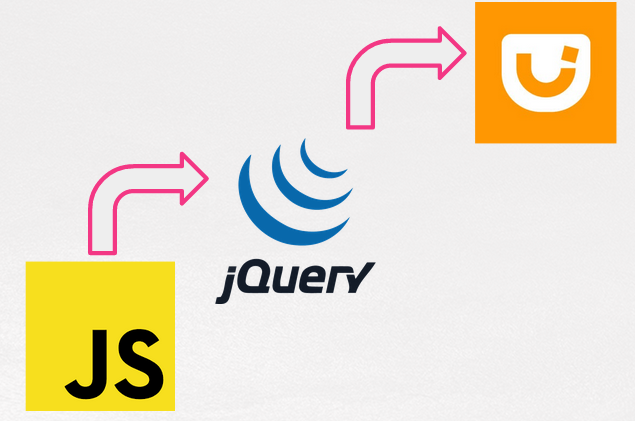

## Parte IX.1. Introducción a jQuery UI

Si atendemos a la definición que nos dan los propios desarrolladores:

> **jQuery UI** es un conjunto seleccionado de efectos, componentes y temas construidos sobre jQuery.

Y esa definición junto con la situación de **jQuery UI** en la siguiente pila de tecnologías:

Nos lleva da decir que:

> **jQuery UI** es una tecnología **construida sobre jQuery** que nos va a permitir dotar de **interactividad compleja** a mi página web de manera más **fácil** ya que **añade** numerosas características nuevas a lo que ya conocemos de **jQuery**.

Podemos instalar jQuery de varias maneras:

- Mediante el uso de la librería por defecto, ya sea porque las descargamos o porque enlazamos a un CDN (Hosted Libraries).
- Seleccionando los componentes que queremos.
- Seleccionando el tema que queremos.

### Elemento de jQuery UI

Los principales elementos de jQuery UI, que trataremos en capítulos posteriores son:

- **Componentes o Widgets**.
- **Efectos**.
- **Interacciones**.
- Repositorio del Curso de jQuery por @pekechis para @OpenWebinars
