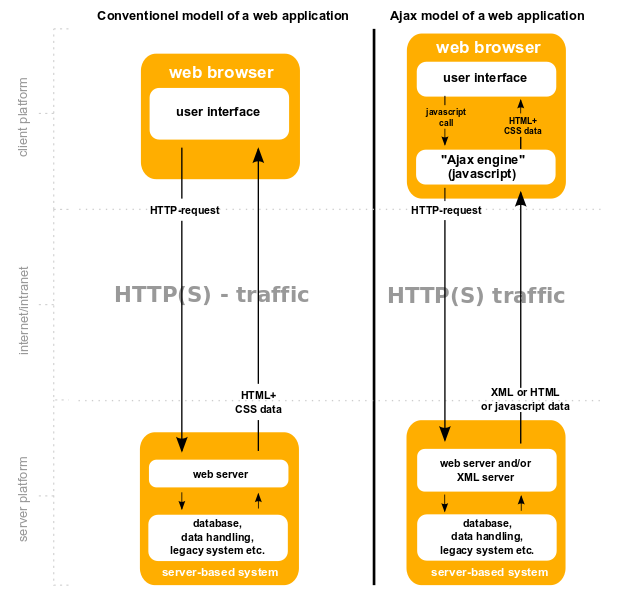
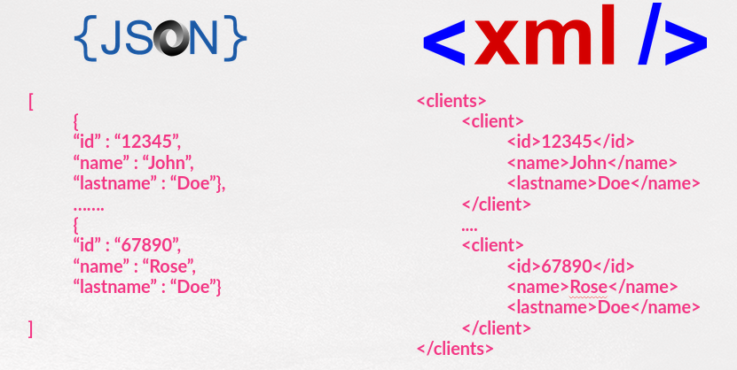

## Parte VIII.2. Utilizando Ajax con jQuery

Si recordamos la definición de MDN (Mozilla Develper Network):

```

JavaScript Asíncrono + XML (AJAX)....conjuntamente con varias tecnologías existentes 
(HTML o XHTML,CSS,JavaScript, DOM, XML,XSLT, y el objeto XMLHttRequest)
...aplicaciones web capaces de actualizarse continuamente sin tener
que volver a cargar la página completa

```

**NOTA**:Extracto de la definición que podemos encontrar [aquí](https://developer.mozilla.org/es/docs/Web/Guide/AJAX)


### Funcionamiento AJAX

Podemos ver el esquema de funcionamiento de las peticiones Http Ajax frente a las peticiones Http tradicionales en la siguiente imagen:



**NOTA:** DanielSHaischt, via Wikimedia Commons [CC BY-SA](https://creativecommons.or)

En este esquema pode ver como:

* A la izquierda tenemos la forma tradicional de trabajar de la web. Cada petición al servidor se traduce en que el servidor devuelve HTML+CSS y esa respuesta hace que el navegador la cargue en nuestra pantalla.
* Sin embargo, en el esquema AJAX efectuamos una petición asíncrona al servidor a través del motor AJAX de javascript. Esta petición llega al servidor que devuelve el tipo de datos que sea (XML, HTML o JSON...) al motor Ajax. Este motor AJAX se encarga de actualizar únicamente la zona de la página que se ha  indicado sin tener que volver a _pintar_ la página completa.


### Tecnologías relacionadas

Dos tecnologías importantes relacionadas con este tipo de llamadas son XML y JSON que sirven para representar la información que nos devuelve el servidor.

Posteriormente somos nosotros los que debemos _pintar_ en HTML la información recibida.

Un ejemplo de ambos se puede ver en la imagen de abajo:



**NOTA:** en este curso nos vamos a centrar en la tecnología **JSON**.

### Ajax y jQuery

**jQuery** hace que las llamadas AJAX sean mucho más fácil con la utilización, principalmente, de las siguiente funciones:

* **\$.ajax() o \$jQuery.ajax():** Es la función principal y la más versátil. Es la que vamos a utilizar en este curso.
* **\$.ajaxgetJSON()  o \$jQuery.getJSON():** Si queremos recibir JSON del servidor mediante una petición GET.
* **\$.ajaxSetup o \$jQuery.ajaxSetup():** Para establecer la configuración por defecto para llamadas Ajax.
* **\$.ajaxget() o \$jQuery.ajaxget():** Para realizar llamadas HTTP GET.
* **\$.ajaxpost() o \$jQuery.post():** Para realizar llamadas HTTP POST.

Usando la primera de las funciones la estructura general simplificada es la siguiente:

```js
    $(function() {

        //Estructura general SIMPLIFICADA
    $.ajax(url[,settings]);

    });

```

Es ese esquema general _**settings**_ es un objeto JSON que tiene multitud de propiedades y funciones que se ejecutarán o no dependiendo del valor de retorno de la petición o de si la petición ha podido realizarse.

Algunos de los miembros más importantes de ese objeto son:

* **async: true** Es la opción por defecto e indica que la petición será asíncrona.
* **contentType: 'application/x-www-form-urlencoded; charset=UTF-8'**, tipo para enviar los datos al servidor. Este es el valor por defecto que nos va a valer.
* **data:** Argumentos que voy a mandar para la petición. Equivalentes a la URL query. Expresado en JSON.
* **dataType: 'xml' / 'html' / 'json'** Tipo de datos que nos va a devolver el servidor.
* **error : function (jqXHR,textStatus, error)** Función que se ejecutará si la llamada ha sido errónea. Puede recibir esos parámetros opcionalmente.
* **header:** Argumento de la cabecera. Expresado en JSON.
* **method: 'get' (or 'post')**.
* **statusCode:** lista de funciones dependiendo del estado (objeto json).
* **success: function(data, textStatus, jqXHR)** Función que se ejecutará si la llamada es exitosa. Opcionalmente puede recibir esos parámetros.
* **complete: function(jqXHR)** Función que se ejecutará al acabar la llamada, tanto si es exitosa como si no.

**NOTA:** No tienen por qué aparecer todos en el objeto Settings. Y recordad, hay muchas más opciones.

En el próximo capítulo empezaremos a usar AJAX con jQuery.

Repositorio del Curso de jQuery desarrollado por @pekechis para @OpenWebinars.
