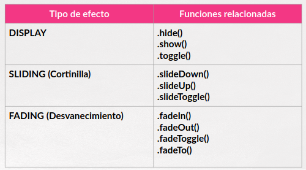

## Parte VII.1.  Efectos

**jQuery** nos proporciona por defecto una serie de métodos  o funciones que nos permiten aplicar efectos comunes de manera sencilla y rápida.

### Tipos de efectos

Podemos ver la clasificación de los los mismos en la siguiente tabla:



El nombre de la función es un claro de indicativo de lo que hacen (si sabemos un poquito de inglés).

### Uso de las funciones de efectos

Todas las funciones que hemos visto anteriormente son muy flexibles y presentan mútiples posibilidades de uso. Nos vamos a centrar en los usos más frecuentes que, además, son comunes a casi todas ellas.

Estos usos más comunes son los siguiente:

* Aplicación del efecto con las opciones por defecto (duración de 400ms).
* Aplicación del efecto cambiando la duración del mismo.
* Aplicación del efecto especificando una función que se va a ejecutar al finalizar el efecto.
* Aplicación del efecto pasándole un objeto de opciones. Este es un poco más complejo ya que son muchas opciones.
* .....algún uso más.


Nos centraremos en los tres primeros usos que son los más frecuentes y los más fáciles.

```js
    //Aplicación del efecto con las opciones por defecto a los elementos seleccionados
    $("some_select").nombre_funcion();

    //Ejemplos Oculta las tablas
    $("table").hide();

    //Especificando una duración concreta para el efecto (en milisegundos).
    $("some_selector").nombre_funcion(num_milisegundos);

    //Ejemplo - Las listas se desvanecen en 5 milisegundos.
    $("ul").fadeOut(5000);

    //Ejecutando una función al acabar el efecto
    //Sin duración
    $("some_selector").nombre_funcion(function() {.....});
    //Con duración
    $("some_selector").nombre_funcion(num_milisegundos,function() {.....});

    //Muestro mensaje al acabar de hacer el efecto "cortinilla" en el formulario
    $("form").slideUp(2000,function() {
        alert("Formulario oculto")
    });

    
```
De todas las funciones señaladas en el capítulo anterior únicamente **.fadeTo()** tiene un comportamiento algo diferente ya que le pasaremos el grado de opacidad destino.

Sería algo así:

```js

    //Opacidad a la mitad en 2 segundos. 
    //El parámetro de la función es opcional.
    $("table").fadeTo(2000,0.5,function() {
        console.log("HOLA);
    });

```
### La cola de efectos (o animaciones)

Para tener un control de los efectos y animaciones debemos de tener cierto control de la cola de efectos ( y animaciones) ya que si le aplico varios efectos y animaciones a un mismo elemento a la vez éstas se van colocando en una cola y cuando finaliza una de ellas, se pasa a la siguiente.

**jQuery** tiene funciones para controlar esta cola.

* **.stop():** Finaliza la aplicación el efecto o animación en curso en los elementos seleccionados.
* **.finish():** Finaliza la aplicación el efecto o animación en curso y elimina las que están esperando en cola finalizándolas (en los elementos seleccionados).
* **.queue('fx'):** Obtiene información de la cola de efectos y animaciones (en los elementos seleccionados).
* **.clearQueue():** Elimina de la cola todos los efectos o animaciones pendientes (en los elementos seleccionados).
* **.delay():** Establece un retraso para el ejecución de los restantes elementos de la cola de efectos y animaciones (en los elementos seleccionados).


Repositorio del Curso de jQuery desarrollado por @pekechis  para @OpenWebinars.
