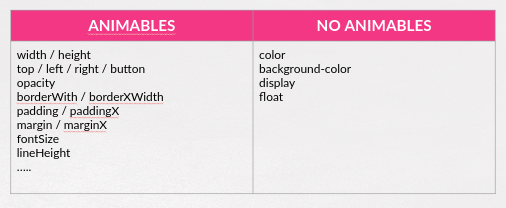

## Parte VII.2. Animaciones

Si, aparte de lo que nos proporciona **jQuery**, queremos montar nuestras propias animaciones y efectos, disponemos de una función para ello, la función **.animate()**.

### ¿ Qué es una animación?

Antes de empezar a usar la función **.animate()** debemos de tener muy claro qué es lo que significa _animar_ desde el punto de vista Web.

De una manera simplificada podemos decir que:

```
Animar: Modificiación de propiedades CSS de los elementos de una página Web a lo largo de un periodo de tiempo especificado.
```

### Propiedades "animables"

Pero no todas las propiedades CSS son animables con **jQuery**.

De manera general podemos decir que una propiedad CSS será animable con jQuery si puede representarse como un valor numérico (unidades incluídas).

En la siguiente tabla podemos ver una pequeña lista de las propiedades que pueden ser animadas y las que no:



Es importante destacar que para propiedades compuestas (como por ejemplo font-size) **jQuery** les cambia el nombre para usar una notación camelCase (fontSize). Además, no se permiten propiedades _atajo_ que me permitan especificar varios valores a la vez.

Si queremos una lista completa y ejemplos podemos encontrarla [aquí](https://www.w3schools.com/jquery/eff_animate.asp).

### La función .animate()

Como muchas de las funciones **jQuery** esta función es muy flexible y tiene muchas posibilidades. En este curso nos centraremos, como hemos venido haciendo hasta ahora, en los usos más frecuentes.

```js
    //Especificando los propiedades
    // Valores especiales ‘show’, ‘hide’ ‘toggle’
    // Incremento con respecto al valor actual += y -=
    $("some_selector").animate({
        prop1 : valor1,
        prop2: valor2,
        …
        proprN : valorN
    });

    //Especificando los propiedades  y duración
    $(“some_selector”).animate({
        prop1 : valor1,
        prop2: valor2,
        …
        proprN : valorN
    }, duración_milisegundos);

```

Podemos ilustarlo con varios ejemplos:

```js
//Animo el tamaño de las letra de los td
//En dos segundos
$("td").animate(
  {
    fontSize: "3rem"
  },
  2000
);

//Incremento el alto y ancho de las imágenes en 3 segundos
$("img").animate(
  {
    height: "+=50px", //50 pixels más
    width: "+=50px" //50 pixels menos
  },
  3000
);

//Efecto de desaparecer de las imágenes
//Cortinilla horizontal
$("img").animate(
  {
    opacity: 0,
    width: "hide"
  },
  5000
);
```

Repositorio del Curso de jQuery desarrollado por @pekechis para @OpenWebinars.
