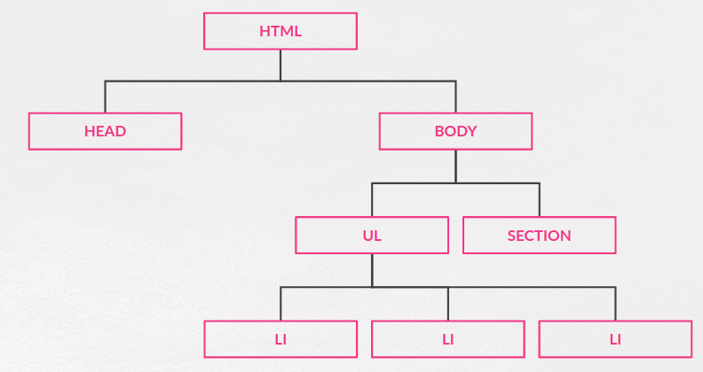

## Parte VI.1. Padres, hijos, hermanos...

**jQuery** me proporciona una serie de funciones que me van a permitir moverme fácilmente por el árbol DOM a partir de los elementos seleccionados. Es lo que en inglés se llama **Traversing**.

Para poder trabajar con esto debemos empezar recordando que todas las páginas tienen forma de árbol.



Y dentro de este árbol existen relaciones de parentesco y precedencia que podemos ilustrar con la siguiente imagen:


De manera resumida tendremos:

- **Padre:** El nodo inmediatamente superior.
- **Hijos:** Todos los nodos que se encuentran debajo justo un nivel de un elemento.
- **Antecesores:** El padre del padre, el padre del padre del padre etc...
- **Sucesores:** Los hijos, los hijos de los hijos etc..
- **Hermanos:** Todos los nodos que tienen el mismo padre.

Y además, según la posición en tendremos hermanos anteriores y hermanos posteriores a un nodo determinado.

### Funciones para el recorrido del árbol

Para recorrer el árbol **jQuery** nos da muchas funciones entre las que destacamos las siguientes:

- **.children()**
- **.next() / .nextAll() / .nextUntil()**
- **.prev() / .prevAll() / .prevUntil()**
- **.parent() / .parents() / .parentUntil()**
- **.closest()**
- **.siblings()**

Hay más funciones pero el propio nombre de cada una de ellos indica, si sabes un poco de inglés, lo que hacen. Además cada una de ellas tiene varia formas de usarse pero para no complicar en exceso y no alargarnos mucho podemos decir que todas (casi todas) se usan de manera general de la siguiente manera:

```js
//Sin filtro. Selecciona todos los elementos
$("some_selector").funcion_de_la_lista();

//El color del texto de todos los hijos de los ul (los li) será rojo
$("ul")
  .children()
  .css("color", "red");

//Tenemos un filtro que le pasamos
$("some_selector").funcion_de_la_lista("otro_selector");

//Lo mismo qu antes pero sólo para los primeros hijos
$("ul")
  .children("li:nth-child(1)")
  .css("color", "red");
```

Repositorio del Curso de jQuery desarrollado por @pekechis para @OpenWebinars.
