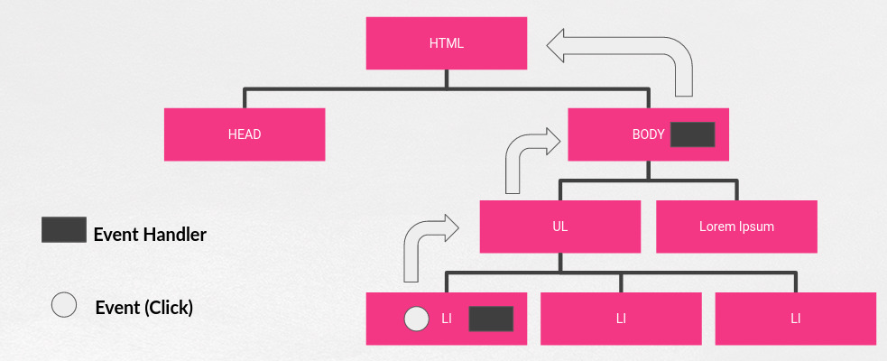

## Parte V.1. Escuchando eventos

Ahora empieza lo bueno de este curso. Hasta ahora hemos visto muchas cosas, pero a partir de ahora vamos a **reaccionar** a lo que sucede en mi página para dar vida a la misma haciéndola **dinámica**.

Para conseguir esta interactividad lo que haremos es usar **jQuery** para **CAPTURAR** eventos y **RESPONDER** a los mismos, entendiendo como **EVENTO** cualquier cosa que sucede en nuestra página web.

Para este trabajo con eventos **jQuery** nos ofrece muchísimas posibilidades y además de ser numerosas son muy flexibles y tienen muchas opciones. Por este motivo en este curso vamos a ver una primera aproximación centrándonos en las más usadas.

### Event Bubbling

Para realizar esa _captura_ y _respuesta_ a los eventos antes debemos entender cómo funcionan, de manera general, los eventos en una página web.

Los eventos siguen lo que se llama **"event bubbling"**, y se van propagando desde el elemento en el que se han producido hacia arriba del DOM hasta que encuentran (en caso de que haya) un manejador o handler.

Si se encuentran con ese handler, lo ejecutan y siguen su camino hacia arriba hasta que llegan arriba del DOM.

Esto proceso se puede ilustrar con una imagen de ejemplo:



Paso a paso lo que sucede es (de manera simplificada):

1. Hacemos click en un li. Al tener manejador se ejecuta.
2. El evento se propaga al ul, al no tener manejador el evento sigue hacia arriba.
3. El evento llega al body que tiene un manejador para el evento click. Éste se ejecuta.
4. El evento sigue subiendo pero no vuelve a encontrar ningún manejador.

### Captura de eventos

Una vez hemos entendido cómo funcionan los eventos vamos a ver que tenemos dos posibilidades para capturarlos y reaccionar a los mismos.

1. Utilizando funciones de carácter general.
2. Utilizando funciones específicas para cada evento que tienen el nombre propio del evento.

#### Funciones general para la captura de eventos

Son principalmente dos, las funciones **.on()** y **.one()**. Ambas son funciones análogas y la diferencia es que **.one()** ejecuta el handler como mucho una vez y luego lo desactiva.

En ambas indico el nombre del evento que quiero capturar y puedo tener una **ASOCIACIÓN DIRECTA** del handler al evento o una **ASOCIACIÓN DELEGADA**. Vamos a proceder a ilustrar su funcionamiento más general (hay más opciones pero para este curso es suficiente):

```js

//ASOCIACIÓN DIRECTA: Se ejecuta el handler cuando sucede el evento en el elemento o en sus hijos.
//event es opcional

$("some_selector").on("event1 event2 eventN", function(event) {
  //Tengo acceso a $(this) (El elemento donde sucedió el evento )
});

//ASOCIACIÓN DELEGADA. Se añade un parámetro y se ejecutará el handler si el evento sucede en algunos de los hijos del elemento que cumple con el selector2

$("some_selector").on("event1 event2 eventN", "selector2",function(event) {
  //Tengo acceso a $(this) (El elemento donde sucedió el evento )
});

//Análogo a on() pero se ejecuta el handler como mucho una vez
//Luego se ELIMINA EL HANDLER. Puedo tener tambié asociación directa e indirecta.
$("some_selector").one("event1 event2….eventN", function(event) {
  //Tengo acceso a $this (elemento donde ocurrió el evento)
});

//Un ejemplo de este uso de handlers
//Un li que muestra cuántas veces hemos hecho click en él o hemos pasado por
//encima con el ratón.

//ASOCIACIÓN DIRECTA
var numVeces = 0;
$("li#ejemplo").on("click mouseenter", function(event) {
  $(this).html("Número de clicks:" + ++numVeces);
});

//ASOCIACIÓN DELEGADA
var numVeces = 0;
$("ul").on("click mouseenter","li#ejemplo", function(event) {
  $(this).html("Número de clicks:" + ++numVeces);
});

```


### Eventos con nombre

El funcionamiento es análogo a la captura con **.on()** o **.one()** pero los eventos "importantes" tienen funciones propias dedicadas. Este tipo de captura **NO** me permite **ASOCIACIÓN DELEGADA**.

De manera general tienen esta sintaxis:

```js

    $("some_selector").nombreEvento(funcion(event) {
        ....
    });

    //El mismo ejemplo con un selector con nombre
    var numVeces = 0;
    $("li#ejemplo").click(funcion(event) {
            $(this).html("Número de clicks:"+(++numVeces));
    });
```

Entre los eventos con nombre más destacados tenemos:

|             |              |               |           |
| :---------: | :----------: | :-----------: | :-------: |
|  .change()  |   .hover()   | .mouseenter() | .resize() |
|  .click()   | .keypress()  | .mouseleave() | .scroll() |
| .dblclick() |  .keydown()  | .mousemove()  | .select() |
|  .focus()   |   .keyup()   |  .mouseout()  | .submit() |
| .focusout() | .mousedown() | .mouseover()  |           |

Aunque algunos necesitan una explicación algo más detallada la verdad es que casi todos son autoexplicativos, dado su nombre.

Veremos algunos con más detalle en el capítulos posteriores.

## El objeto EVENT

Si, como hemos hecho hasta ahora, ponemos a disposición del handler el objeto **EVENT** este objeto puede proporcionarnos muchas **información adicional** sonre el evento, **parar el event bubbling**, **evitar comportamientos por defecto** y muchas más cosas.

Tiene muchas propiedades y métodos pero las más comunmente usadas son:

|                    |                     |           |
| :----------------: | :-----------------: | :-------: |
|  e.currentTarget   | e.stopPropagation() |           |
| e.delegatedTarget  |      e.Target       |           |
|      e.pageX       |     e.timeStamp     | e.metaKey |
|      e.pageY       |       e.type        |           |
| e.preventDefault() |       e.which       |           |

Aunque algunos necesitan una explicación algo más detallada la verdad es que casi todos son autoexplicativos, dado su nombre.

Veremos algunos con más detalle en el capítulos posteriores.

Repositorio del Curso de jQuery desarrollado por @pekechis para @OpenWebinars.
